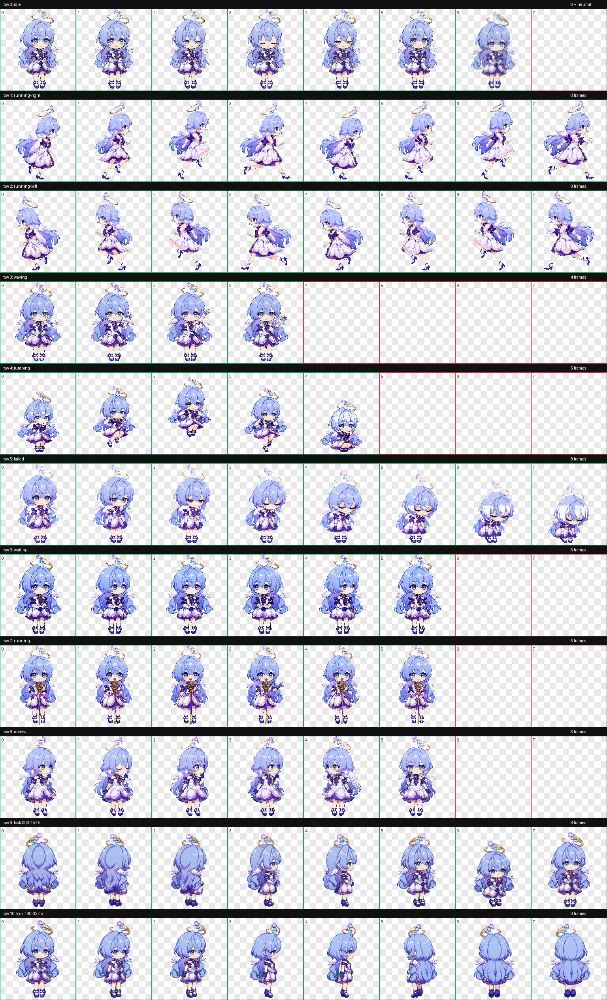

# Robin Star Rail Codex Pet

Robin Star Rail is a free, open-source animated pet for Codex.



## 中文说明

Robin Star Rail 是一个免费开源的 Codex 动态宠物。

安装方法：把 `pets/robin` 目录里的 `pet.json` 和 `spritesheet.webp` 复制到你的 Codex 宠物目录，然后重启 Codex 并选择 `Robin`。

### Windows PowerShell

```powershell
New-Item -ItemType Directory -Force "$env:USERPROFILE\.codex\pets\robin"
Copy-Item ".\pets\robin\*" "$env:USERPROFILE\.codex\pets\robin" -Force
```

### macOS / Linux

```bash
mkdir -p ~/.codex/pets/robin
cp pets/robin/* ~/.codex/pets/robin/
```

## English

## Install

Copy the pet files into your Codex pets directory, then restart Codex and select `Robin`.

### Windows PowerShell

```powershell
New-Item -ItemType Directory -Force "$env:USERPROFILE\.codex\pets\robin"
Copy-Item ".\pets\robin\*" "$env:USERPROFILE\.codex\pets\robin" -Force
```

### macOS / Linux

```bash
mkdir -p ~/.codex/pets/robin
cp pets/robin/* ~/.codex/pets/robin/
```

## Files

- `pets/robin/pet.json`
- `pets/robin/spritesheet.webp`

## Compatibility

- Codex pet sprite version: `2`
- Sprite sheet: `1536x2288`
- Cell size: `192x208`
- Layout: `8` columns by `11` rows

## Validation

This package includes the generated validation report at `qa/validation-extended.json`.

Current validation status: passed.

## License

The Robin Star Rail pet artwork and package files are licensed under Creative Commons Attribution 4.0 International.

This is an unofficial community pet and is not affiliated with OpenAI or any official Star Rail team.
